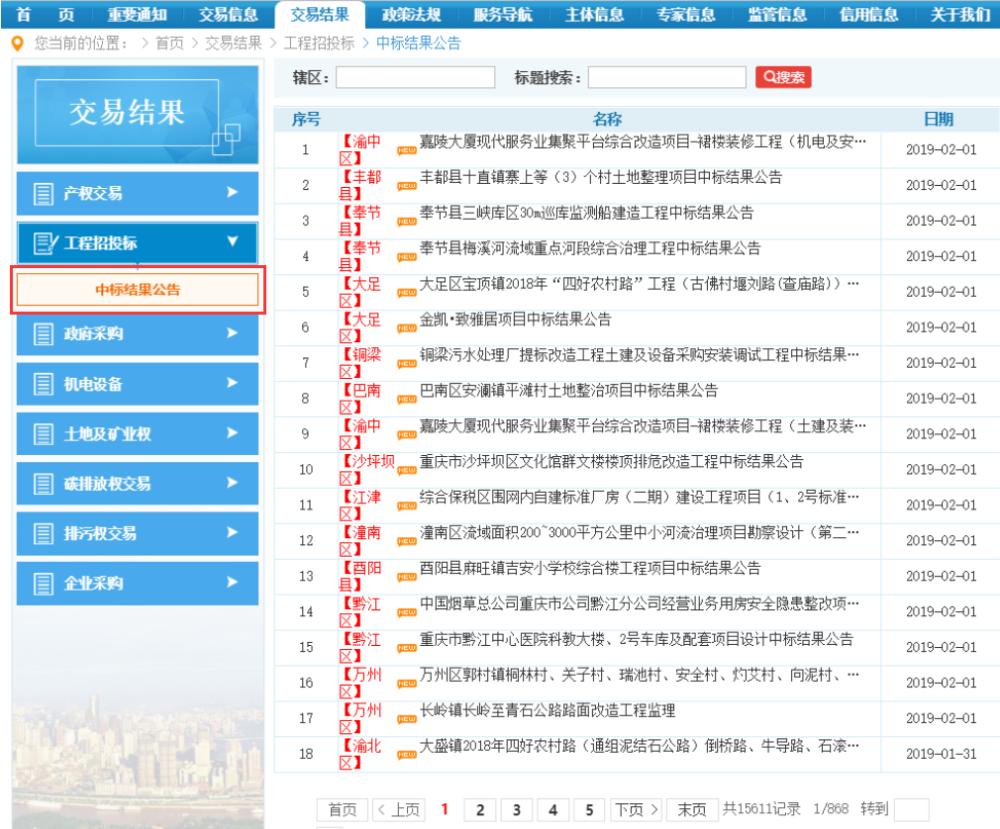
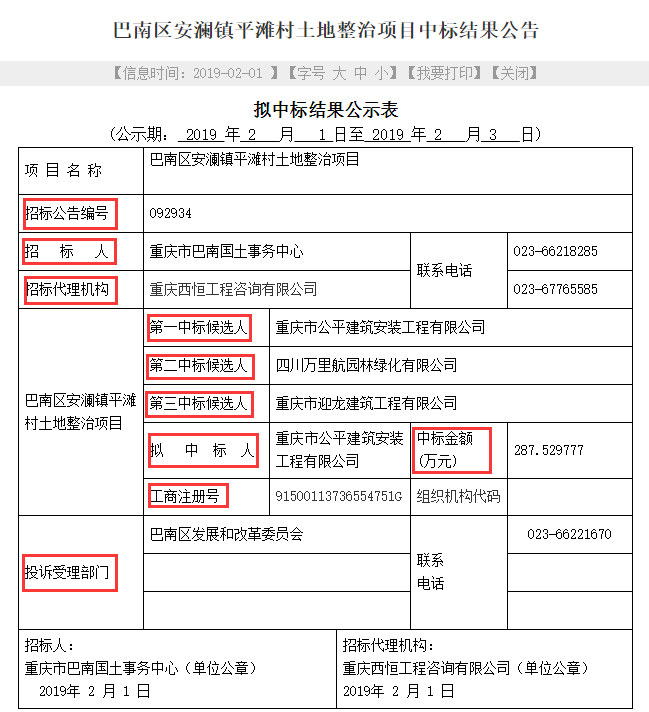
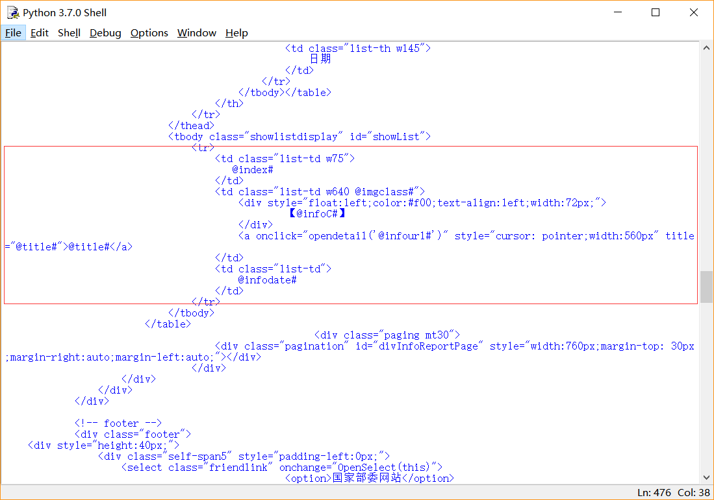
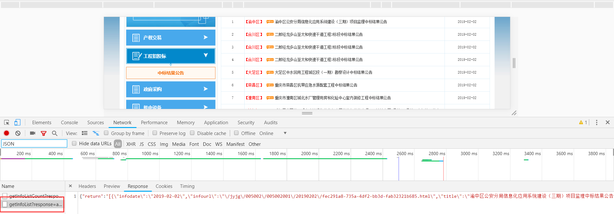
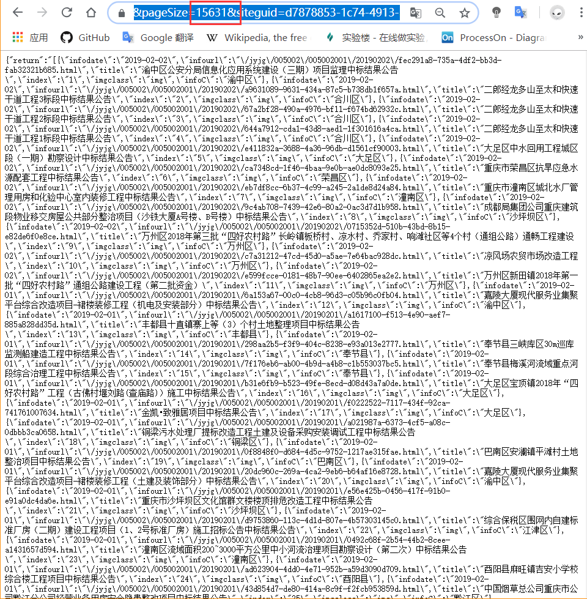
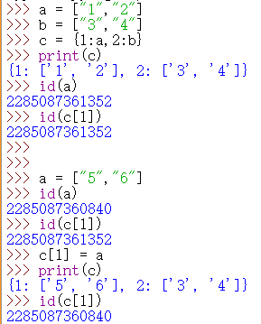
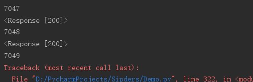
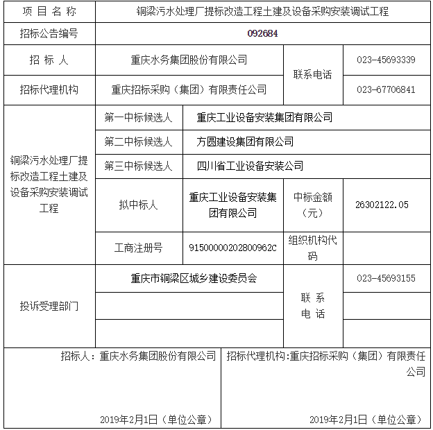
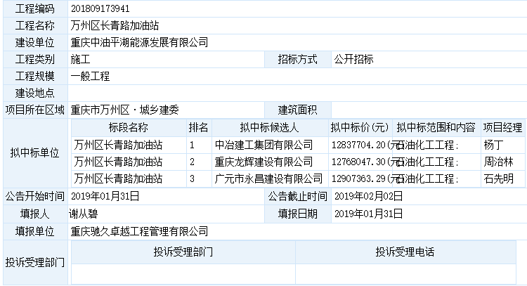

# 软云寒假爬虫作业：任务一

## 任务说明：

- 目标网站：重庆市公共资源交易网 https://www.cqggzy.com/jyjg/005002/second-page-jyjg.html 

- 抓取内容：**交易结果** 中的 **工程招投标** 中的 **中标结果公告** 中的各项 **中标结果** 的

   > 

   *项目名称* 、*日期*、*网址*  和 **网址中** 的 **表格中** 的（以下只是一个理想的例子，实际情况太踏🐴坑爹了）

   

   *中标时间* （每个表格没有具体的中标时间，所以用刊登日期代替）

   *招标人*（填报人也理解为招标人）

   招标公告编号*（工程编码、标段编号）*

   *招标代理机构*、*第一第二第三中标候选人*、*拟中标人*、*工商注册号*、*投诉受理部门*、*中标价*、*第二第三中标人价格*

   ​

***

## 踩坑介绍：

**写在前面：本次的任务应该在Ubuntu上进行，但虚拟机太卡了，而且AMD的显卡死活装不了Ubuntu，所以我选择在PyCharm上用 requests 和 bs4 中的 BeautifulSoup 的搭配抓取网页数据。我踩了很多坑，但更多的是菜鸟的学习过程。**

**以下**☀️

- 第一个遇到的问题就是：BeautifulSoup会丢数据。

  *一个页面中至少有18个 tr 标签（因为一个页面显示18个项目），但最后 BeautifulSoup 解析出来的数据只有一个 tr 标签。*（如下面的框框所示）

  

  至于为什么会丢失数据，有以下两个思路：

  - BeautifulSoup 默认解析器的问题。
  - 另一个就是 BeautifulSoup **本身** 在处理 **结构不规范的数据** 时候会丢失数据的问题。[BeautifulSoup 为什么会丢失数据？](https://www.crummy.com/software/BeautifulSoup/bs3/documentation.zh.html#Beautiful%20Soup%20loses%20the%20data%20I%20fed%20it%21%20Why?%20WHY?????)

  解决：

  发现在点击中标结果公示（图1里的红框框）的时候会返回一个JSON格式的数据包。

  里面贮存着所有项目的项目名称、链接、日期。

  

  ​

  可以通过修改红框框里的数字进行所有 **链接等数据** 的提取。（大写的 😆

  

  ​

- 第二问题是：字典的改

  这个问题非常智障。😑

  话不多说，上图。

  

  ​

- 第三个问题：

  出现两次数组越界，仅仅加了判断。

  

***

**来小小的总结一下吧** 

- 只对这两种表格进行了重点的处理：

  

  

- 在对于每次测试时没爬到的数据也只是简单得添加了一些判断。其他爬不到的数据依旧爬不到。所以在爬后面的部分数据的时候，并不能做到适配。代码不具备普遍性。😰

- 对基本数据类型理解并不透彻。

- 而在正式爬的时候并没有对 **匹配数据** 的其他符号进行处理（如：冒号":”、“："，括号：”（）“，”()“），只对空白字符进行了处理。（这谁能想的到啊。😭）

- 在写代码的时候没有顾及的问题：编码问题、request请求时的异常处理。

- 在此期间，网站更新了三次数据。（）

  ​

  **以上**🌝
